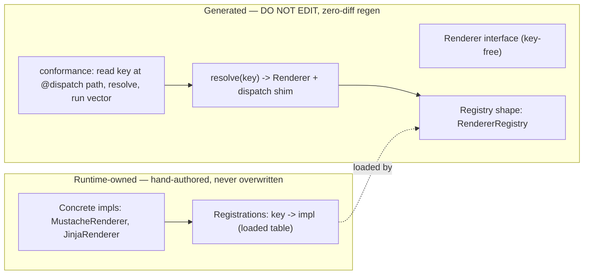

# Plan: shared vector runner + behavioral polymorphic dispatch

Status: **design locked, implementation not started.** This document is the source of
truth for two sequenced emitter investments and the decisions behind them, so that
execution does not drift from intent. It refines the roadmap bullets "polymorphic
dispatch" (Executable conformance §1) and "Discriminator dispatch rules and fallback
behavior" (Runtime semantics contract §4) in `best-in-class-roadmap.md`.

Owner: emitter (`@typra/emitter`). Primary consumer driving the requirements:
**Prompty** (`microsoft/prompty`), which emits a cross-runtime `@vector` conformance
harness into 7 runtimes (python, typescript, csharp, rust, go, java, swift).

## Current state of the world

Already shipped to `main`:

- **#275** — generated **requirement/capability guard** for `@vector` conformance
  harnesses, plus the refactor to emit **per-vector** conformance tests instead of a
  monolithic payload loop. A vector may declare `requires: ["provider:openai", ...]`;
  the harness resolves each token against a runtime-supplied `VECTOR_CAPABILITIES`
  table and emits a language-native skip (`requirement unavailable: <token>`) before
  the adapter `invoke`. Three distinct axes are kept separate: **waiver** (permanent
  gap), **capability-absent** (this guard), **failure** (implemented + capability
  present + wrong structure).
- **#276** — symmetric `fromWire(provider)` emission for `@knownAs` wire mappings.

Not shipped, not committed:

- A **runner-extraction spike** (TypeScript + Python reached green, the other five
  runtimes not started) explored relocating the inline conformance interpreter into a
  shared module. It is treated here as a **discardable spike**: because the emitter is
  deterministic, its output is trivially regenerable, so nothing in the partial diff is
  precious. The *design* it surfaced (below) is the durable output and is captured here.
  The extraction will be executed later **end-to-end as a single clean PR** across all
  7 runtimes, not landed 2-of-7.

## Vocabulary: three axes that must never be conflated

These look similar and are repeatedly confused. They are categorically different.

- **Axis A — behavioral interface dispatch.** A seam `interface` has several
  interchangeable implementations selected at runtime by a key (e.g. a `Renderer` with
  `mustache` vs `jinja2` engines). Resolution is a **keyed registry** (`key -> impl`).
  This is **T4**, designed below. v1 Prompty did this as a type-name-keyed registry in
  Python; every language has an equivalent.
- **Axis B — wire-format variance of a data model.** One model type serializes
  differently per provider (openai vs anthropic). Handled by `@knownAs` / `toWire` /
  `fromWire` + dedicated wire models. This is a **variation on a data model, not an
  interface implementation.** Already shipped (#276). Out of scope here.
- **Axis C — schema discriminated unions.** A payload that is one-of several typed
  shapes. Pure data modeling. Out of scope here.

Also distinct, and not to be confused with Axis A's key: the vector-level `provider`
field selects **which runtime maps a vector**; the Axis A discriminator selects **which
in-runtime implementation** a config object resolves to.

---

# Part I — Shared vector runner extraction

## Goal

Today the emitter inlines the entire vector-conformance interpreter into each language's
**test file**: reference resolution (`$env` / `$file` / `$json`), canonical/stable JSON,
adapter lookup with bare-op fallback, the #275 requirement/capability guard, per-vector
waiver xfail/xpass, await-if-awaitable + `@sync` enforcement, and canonical-equality
assertion. That interpreter is duplicated across 7 entangled test files, which is the
worst place to evolve it — and Part II (T4) adds *more* interpreter logic.

The extraction relocates that interpreter into a separate emitted **runner module**
(`vector-runner.ts`, `vector_runner.py`, …). The test file becomes **thin**: it loads
the runtime-authored seam tables and calls `runner.runVector(contract, op, vector, sync,
seam)` per vector. This is a **relocate-only, zero-behavior-change** refactor of the
emitter's codegen templates.

## Design decisions

1. **Seam-agnostic runner (behavioral definition).** The runner reads **zero authored
   values** — no authored globals, tables, functions, or registrations. Behavior is
   fully determined by parameters the thin harness injects (adapters / waivers /
   capabilities / doubles). This is what makes the interpreter independently
   unit-testable: closed-loop tests inject fakes and assert interpreter behavior
   directly. "Seam-agnostic" is a statement about **values, not types** (see #3).

2. **Requires-gated capability emission (Decision #3).** The capability guard is emitted
   **unconditionally** in the runner, but the harness only loads `vectorCapabilities` /
   includes the `capabilities:` seam entry when at least one vector declares `requires`.
   Requires-free harnesses regenerate **byte-identical** — clean no-op for the
   schema-repro-check.

3. **Type ownership across languages — the Option-A ruling.** Who owns the interpreter's
   port types (`Context` / `Adapter` / `Invoke`) differs by language:

   - **Emitted-type targets** (TS, Python, Java, Swift): the runner **owns** the port
     types. Structural typing (TS, Python) or emitted-nested types (Java, Swift) mean the
     runner is fully seam-agnostic in every sense — it needs no authored types.
   - **Authored-type targets** (Go, C#, Rust): the runtime-authored seam **owns** the
     port types (`vectoradapters.Context/Adapter`, `VectorContext/VectorAdapter`,
     `vector_adapters::Context/Adapter/Invoke`). Nominal typing gives no structural
     escape.

   For the authored-type trio, three pinned constraints cannot all hold at once:
   (a) runner imports no authored seam, (b) no typed port introduced, (c) relocate-only.
   **Ruling: Option A — the runner imports the authored seam's port TYPES ONLY**, while
   the harness still loads the seam TABLES and passes them into runner helpers. This is
   justified by the behavioral definition of "seam-agnostic" in #1: a type-only import
   reads no authored state, so the property the closed-loop tests verify is preserved. In
   nominally-typed languages the port types *are* the shared vocabulary; requiring "no
   shared types" there is equivalent to requiring "no shared interpreter," which defeats
   the extraction.

   Rejected alternative (Option B): extract only the pure, type-free helpers
   (canonical / resolveRefs / baseDir / equality) and leave the seam-typed orchestration
   inline for go/csharp/rust. This extracts the lowest-divergence-risk code and leaves the
   highest-risk orchestration (guard / waiver / sync / invoke) duplicated in exactly the
   three languages where divergence is most dangerous.

### Option-A guardrails (all must hold)

- **Type-only import.** Import only the port TYPE names. The runner references zero
  authored globals / tables / functions. Every table stays loaded by the harness and is
  passed into runner helpers as parameters. Reading an authored global inside the runner
  is the real line — do not cross it.
- **Closed-loop tests keep injecting fakes**, proving the runner's behavior is
  independent of authored registrations.
- **Go shape.** "Same package as harness + non-`_test`" is inexpressible (a non-`_test`
  file cannot be `package fixtures_test`). The Go runner is its **own regular package**
  `vectorrunner` that imports the authored `vectoradapters` package for types; the
  harness `_test.go` imports both.
- **Document the asymmetry** in the runner file's DO-NOT-EDIT header: for
  nominally-typed targets the runner imports the seam's port types only and reads no
  authored values, so the coupling is intentional and reviewers do not "fix" it.
- **Relocate-only / zero behavior change / deterministic zero-diff regen.**

## Validation gates (per runtime, before moving on)

- `npm run generate:fixtures` run twice → idempotency guard clean for the target.
- Full `npm run validate:fixtures` green (pre-existing #238 idempotency deferrals for
  rust/swift/java/zod remain, and must not grow).
- Targeted emitter unit tests, including the closed-loop suites, repointed at the runner
  module.

---

# Part II — T4: behavioral polymorphic dispatch (`@dispatch`)

## Problem

Prompty needs to render templates with interchangeable engines (`mustache`, `jinja2`,
future engines) behind one `Renderer` seam. Today the runtimes hand-roll this as a
`switch engine` (e.g. Go `render.go` dispatches to `jinjasubset.Render` vs a local
`renderMustache`), and the **emitter emits none of the dispatch** — the emitted
`Renderer` interface doesn't even take the engine; the runtime pulls it from config
(`agent.Template.Format.Kind`) and branches by hand. That is 7 divergent reimplementations
of the same dispatch, and adding an engine touches every runtime.

## Design principles

1. **Emit the mechanism, never the roster.** The schema declares *that* dispatch happens
   and *what key* selects the implementation. The concrete implementations are
   **runtime-registered** (`register("mustache", MustacheRenderer())`). Adding an
   implementation must never require a schema edit or a regen.
2. **The discriminator is an ambient model field, not an operation parameter.**
   Key-as-parameter (`render(engine, …)`) is `switch()` in disguise — fake polymorphism.
   The discriminator is a field on a config/context model; seam methods stay **key-free**
   (`render(agent, template, inputs)`), and the implementation is resolved **once** from
   that field. This mirrors the real Prompty runtime.
3. **Concrete types are never emitted (ownership/regeneration boundary).** Generated
   files are DO-NOT-EDIT and regenerated to zero-diff. Any concrete impl — or a registry
   that *names* concrete impls — placed in a generated file would be runtime-owned code
   in the clobber path, fighting the zero-diff gate. So the emitter emits only the
   interface + registry shape + resolve/dispatch shim; registration lives in a
   runtime-authored file the emitter **loads**, exactly like the `VECTOR_ADAPTERS` /
   `VECTOR_CAPABILITIES` tables the harness already loads, and like `@method`
   create-if-missing stubs whose bodies the runtime owns.

## The `@dispatch` decorator

```tsp
@dispatch(TemplateFormat.kind)
interface Renderer {
  render(agent: Agent, template: Template, inputs: Inputs): string;
}
```

- **Applied to:** an `interface` (the swappable seam). Standalone `op` is out of scope —
  the callable surface only collects `namespace.interfaces`; a bare `op` is the
  static/free-function case and contributes nothing to the seam/vector surface today.
- **Argument:** a reference to the discriminator **ModelProperty** (the same target class
  `@knownAs` uses). `TemplateFormat.kind` names the ambient field whose value is the
  registry key.
- **Seam methods stay key-free.** The engine is never a parameter.

## Discriminator path resolution

The conformance harness and the runtime dispatch shim must read the key **identically**.
The discriminator field (`TemplateFormat.kind`) must be **reachable from one of the seam
method's parameters** via a field-access path (e.g. from `agent` → `agent.template.format.kind`).

- The emitter computes that access path and emits it into both the runtime resolve shim
  and the conformance harness, so both extract the key the same way.
- **Uniqueness constraint:** the field must be **uniquely reachable** (a single
  unambiguous path) from the parameter set. Ambiguous or unreachable ⇒ **diagnostic**,
  not a guessed path. This keeps emission deterministic (stable path = zero-diff).

## Emission: generated vs runtime-owned



- **Generated (regenerated, zero-diff, DO NOT EDIT):** the `Renderer` interface, the
  registry *shape*, `resolve(key) -> Renderer` + dispatch, and the conformance harness
  that reads the key at the `@dispatch` path and resolves. **None of this names a concrete
  impl.**
- **Runtime-owned (hand-authored, never overwritten):** the concrete classes and the
  registrations that populate the registry.
- **Default seam style:** the `VECTOR_ADAPTERS`-style **loaded table** (`registry ←
  import runtime module exporting {key → impl}`), consistent with the harness. The
  `@method`-style create-if-missing registration stub is the alternative. Either keeps
  concrete types entirely out of the generated path.

Per-language registry primitive (shape only; never names an impl): Python dict, C#
dictionary/DI, Go map, Rust map → trait object, TS/Java/Swift map.

## Conformance and the absent-impl case

Conformance resolves the key by the `@dispatch` path, then looks up the registry. **An
impl absent from the registry reuses the #275 capability-absent skip**
(`requirement unavailable: <token>`) rather than failing. Coverage emerges from
*which vectors exist × which impls are registered* — no schema roster is needed.

**Rust skip policy** (inherited from #275): Rust has no runtime-conditional skip
(`#[ignore]` is compile-time). The absent-impl / capability-absent case is best-effort:
`eprintln!("SKIP <reason>"); return;` — passes and records intent. "Uniform skip" is
documented as best-effort per language.

## Out of scope for T4

- **Axis B** (wire-format variance) — different mechanism (`@knownAs`/`toWire`/`fromWire`),
  already shipped.
- **Standalone `op` / static methods** — not part of the behavioral-seam model; net-new,
  deferrable. Consider a diagnostic if `@vector` (or `@dispatch`) is applied to a bare op.
- **model-per-impl markers** (`@implements(Renderer,"mustache") model MustacheRenderer{}`)
  — puts the roster back in the schema and is a hollow marker (the impl is runtime code).
  Rejected.
- **`@protocol`** — dead decorator (declared, zero fixture usages). The live seam
  primitive is a plain TypeSpec `interface`. Prunable separately.

---

# Part III — typed `@dispatch` resolver (landed: rail + typed conformance)

Part III (issue `sethjuarez/typra#282`, continuing `#280` II-A + `#281` II-B) moves
behavioral `@dispatch` off the stringly-typed `Contract.operation#value` runtime
dictionary and onto the **same `PolymorphicDispatchDecl` rail the emitter uses for
SHAPES**. For each dispatched seam every language emits, as a **library** artifact, the
twin of the shape `Load` switch: a **provider type** (one slot per `@dispatch` variant)
plus a **completeness-checked resolver** (`resolve_<seam>(kind, provider)`) selecting the
consumer-attached `I<Seam>` impl.

Landed in Part III: the IR seam (`CallableDispatch.decl` →
the discriminator model's `PolymorphicDispatchDecl`), provider + resolver emission for all
7 runtimes, and a permanent per-language proof test asserting rendered target code —
positive routing reproduces each vector's `expected`, and a missing provider slot **fails
to compile** (C#/TS/Java/Rust/Swift) or **raises at collection** (Go/Python). Enforcement:
compile-time for C#/TS/Java/Rust/Swift, runtime for Go/Python.

Also landed: the emitted **`@vector` conformance is now typed** for all 7 languages. Each
language partitions its vectors — typed (polymorphic-`decl`) entries emit **per-interface
conformance files in namespace folders** (§8 parity with the `@sample`/model-test
convention) that import the consumer provider, call `resolve_<seam>`, and invoke the typed
seam with typed input; the monolithic stringly runner + its `#value` dispatch branch are
emitted **only when undispatched vectors remain**. A fully-dispatched group emits no
stringly artifact (verified: zero `operation#value` routing in the emitted tree).

Deliberately **retained** (permitted by #282 §7): the `#value` runner **strictly as the
undispatched safety net**. A `@dispatch` whose discriminator model is not polymorphic
carries a path but no `decl`, so it stays on the stringly runner and its conformance is
never silently dropped. The undispatched single-adapter branch is untouched (no regression).
#282 is **closed** by this work.

Full Part III design, the Phase-3 resolution rationale, and the acceptance gates live in
[`dispatch-typed-resolver-plan.md`](./dispatch-typed-resolver-plan.md).

---

# Sequencing

1. **Runner extraction first (enabler).** Execute end-to-end across all 7 runtimes as one
   clean PR: TS reference shape → python → go → csharp → rust → swift → java, gates green
   after each, Option-A guardrails for go/csharp/rust. This isolates and unit-tests the
   interpreter so T4's dispatch logic lands in one clean module per language instead of
   entangled in 7 test files.
2. **Then T4.** `@dispatch` decorator + IR extension + path resolution + per-language
   registry/resolve/register emission + conformance-by-path, reusing the #275 absent-skip.
   Coordinate the spec with the parallel Prompty reference-impl so generated output and the
   reference stay in lockstep.

# Hard constraints (both parts)

- **Determinism / zero-diff:** the schema-repro-check regenerates all runtimes and asserts
  zero git diff. Stable ordering and stable strings are mandatory; regeneration must be a
  no-op.
- Repo files are CRLF; the idempotency gate formats emitted copies (prettier printWidth 80
  / ruff). rust/swift/java/zod carry pre-existing #238 idempotency deferrals — do not grow
  them.
- Python validates via
  `uv run --python 3.12 --with pydantic --with pytest --with PyYAML python`.
- **Conventional Commits**; release-please owns the version, manifest, and CHANGELOG —
  never hand-edit them.

# Open questions

- Registration seam style per language: default to the loaded-table form, or allow the
  create-if-missing stub where a language's DI/registration idiom prefers it?
- Exact decorator name (`@dispatch`) and whether the discriminator argument should also
  accept a dotted path literal for cases where the field is not a direct `Model.property`
  reference.
- Whether to add the bare-`op` diagnostic now (small, orthogonal) or with T4.
